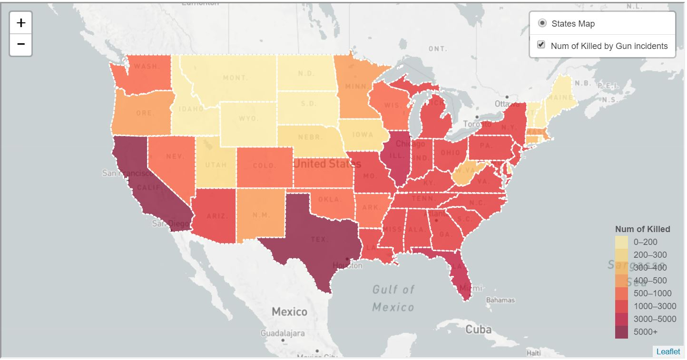
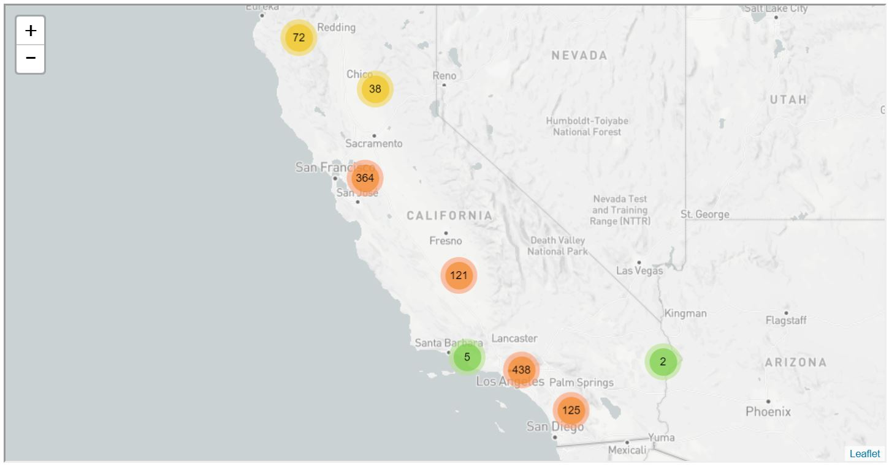
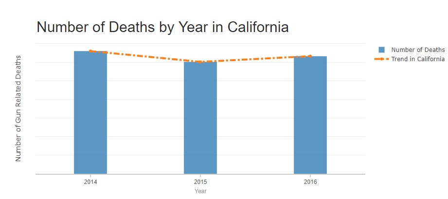

# Gun Violence in America

***
## Our Team:
* Sue Hellen Del Carpio Bellido Vargas
* Cesar Castrejon
* Roger Tran
* Fahim
* Yoyo Wu

### Our Premise: 
To run an analysis that allows us to observe trends in gun related incidents accross America as well as
provide insight into the classification of these occurrences.

### Our Process:

We began by gathering data from Kaggle. This data contained a list of gun related incidents along with the date of occurrence
the type of incident and the location. We analyzed these incidents and used three visualizations to tell our story.

#### Our Vizualizations: 
* 1st view: People killed by gun incidents.
This map includes the number of killed persons from 2014 to 2018-march

* 2nd view: People killed in California.
This map includes a cluster of markers. Each marker represents the exact position of the gun incident and the type of incident: Suicide, Mass Shooting, School Shooting, etc.

* 3rd view: Number of Gun Related Incidents by Type.

#### Data Sources: 
* https://www.kaggle.com/jameslko/gun-violence-data/version/1#